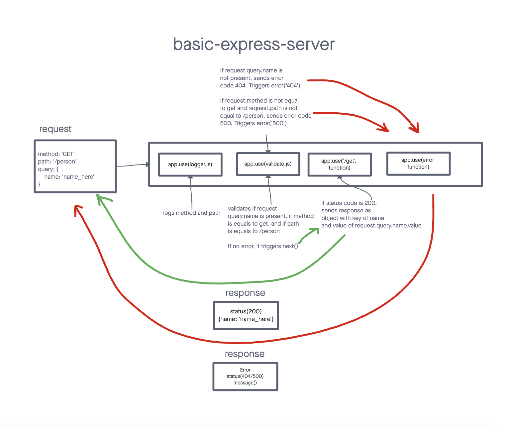

# Basic Express Server

>  Building express server using best practices, including server modularization, use of middleware, and tests.

## Installation

> Start with: `npm install`

> Set your PORT environment with an .env file

```text
PORT=3001
```

## Usage

Send a request:

```text
method: GET
route: /person
query:
  name={nameOfPerson}
```

## UML Diagram


## Deployed link
> This is deployed on Render at:
* [Main/Production Branch](https://basic-express-server-svjf.onrender.com)

## PR link
[PR link](https://github.com/cleecoloma/basic-express-server/pull/1)

## Contributors
> Chester Lee Coloma